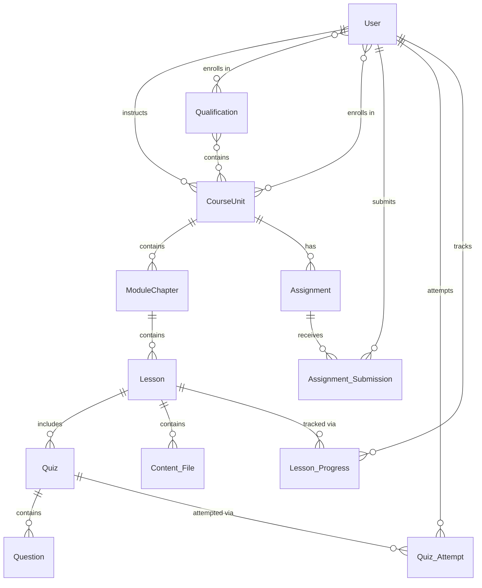

# Entity Relationship Diagram (ERD)

This document contains the database schema design for the Sample Web
application.

## Sample ERD Placeholder

> **Note**: This section should contain the actual ERD for the Sample Web
> application. Replace this placeholder with the specific database schema design
> that matches your application's requirements.

### Current Application Schema

The Sample Web application uses DynamoDB tables for:

- User management (via AWS Cognito)
- Assignment storage and metadata
- Application-specific data structures

_TODO: Replace this section with the actual ERD diagram for the Sample Web
application_

---

## Example ERD Structure (Reference)

Below is an example ERD structure for a learning management system, provided as
a reference for complex database relationships:

### Example Database Schema Overview

The ERD below illustrates the core entities and their relationships in a complex
learning management system, including users, qualifications, courses, lessons,
assessments, and tracking mechanisms.

### Example Structure

```
Qualification (Learning Path)
    ↓ contains multiple
CourseUnit (Course/Unit)
    ├── contains multiple ModuleChapter (Module/Chapter)
    │   └── contains multiple Lesson
    │       ├── includes Quiz (lesson-specific)
    │       ├── contains Content_File
    │       └── tracked via Lesson_Progress
    └── has Assignment (course-wide)
```

### Example Real-World Application

```
Qualification: "Full Stack Web Development"
├── Course(Unit): "Frontend Development"
│   ├── Module(Chapter): "HTML & CSS"
│   │   ├── Lesson: "HTML Structure"
│   │   │   ├── Quiz: "HTML Elements Test"
│   │   │   └── Content: html_tutorial.pdf
│   │   ├── Lesson: "CSS Styling"
│   │   │   ├── Quiz: "CSS Properties Test"
│   │   │   └── Content: css_examples.zip
│   │   └── Lesson: "Responsive Design"
│   │       ├── Quiz: "Media Queries Test"
│   │       └── Content: responsive_demo.html
│   └── Assignment: "Build a Complete Landing Page"
```

### Example Clear Hierarchy

- **Qualification** - Overall learning path
- **CourseUnit** - Main subject/course
- **ModuleChapter** - Topic groups within course
- **Lesson** - Individual learning sessions
- **Content_File** - Learning materials in lessons

### Example Assessment Levels

- **Quiz**: Lesson-level (tests specific lesson content)
- **Assignment**: CourseUnit-level (comprehensive course assessment)



### Example Key Relationships

#### User-Centric Relationships

- **User ↔ Qualification**: Many-to-many enrollment relationship
- **User ↔ CourseUnit**: Many-to-many enrollment and one-to-many instruction
  relationships
- **User → Submissions/Attempts**: One-to-many tracking of student activities

#### Content Hierarchy

- **Qualification → CourseUnit → ModuleChapter → Lesson**: Hierarchical content
  organization
- **Lesson → Content_File**: Direct content attachment
- **Lesson → Quiz**: Embedded assessments

#### Assessment System

- **Assignment ↔ Assignment_Submission**: One-to-many submission tracking
- **Quiz ↔ Quiz_Attempt**: One-to-many attempt tracking
- **Quiz → Question**: One-to-many question composition

#### Progress Tracking

- **Lesson_Progress**: Tracks user progress through individual lessons
- Links users to lessons with completion status and metrics
