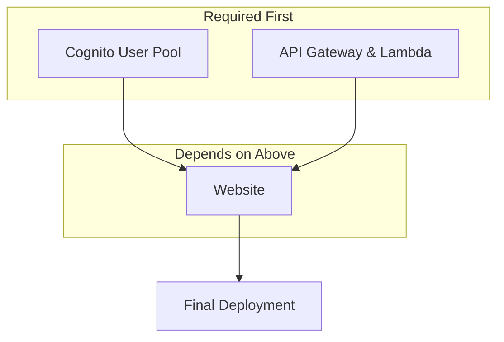

# Deployment Guide

## Overview
This infrastructure uses AWS CDK to deploy a React web application with CloudFront distribution, S3 hosting, and AWS Cognito authentication.

## Architecture



**Infrastructure Components:**
1. **Cognito Resources** - User Pool, User Pool Client, Identity Pool for authentication
2. **API Gateway & Lambda** - REST API with Lambda functions for backend services  
3. **Website Deployment** - S3 Bucket, CloudFront Distribution with environment variables

## Deployment Options

### Option 1: Default CloudFront Domain (Recommended for Development)
```typescript
// In bin/infra.ts - comment out or remove domainName
const infraStack = new InfraStack(app, "InfraStack", {
  env: {
    account: process.env.CDK_DEFAULT_ACCOUNT,
    region: process.env.CDK_DEFAULT_REGION,
  },
  // domainName: "your-domain.com", // Comment this out
});
```

**Pros:**
- No DNS setup required
- SSL certificate automatically provided by CloudFront
- Immediate deployment

**Cons:**
- Uses CloudFront domain (e.g., `d123456abcdef8.cloudfront.net`)

### Option 2: Custom Domain with SSL Certificate
```typescript
// In bin/infra.ts - specify your domain
const infraStack = new InfraStack(app, "InfraStack", {
  env: {
    account: process.env.CDK_DEFAULT_ACCOUNT,
    region: process.env.CDK_DEFAULT_REGION,
  },
  domainName: "your-domain.com", // Your custom domain
});
```

## Custom Domain Deployment Process

### ⚠️ Important: Manual DNS Steps Required

When deploying with a custom domain, you **MUST** complete these DNS steps manually:

### Step 1: Certificate Validation (During Deployment)
1. **Run the deployment**: `./deploy.sh` (or with environment: `STACK_PREFIX=staging- ./deploy.sh`)
2. **Monitor the UI stack deployment** - it will create an ACM certificate
3. **The deployment will pause** at certificate validation (status: "Pending Validation")
4. **Go to AWS Console** → Certificate Manager → Find your certificate
5. **Copy the DNS validation records** (CNAME records)
6. **Add these records to Route 53** (or your DNS provider):
   - Type: CNAME
   - Name: `_abc123...` (provided by ACM)
   - Value: `_xyz789...cloudfront.net` (provided by ACM)
7. **Wait for validation** (usually 5-10 minutes)
8. **Deployment will continue** once certificate is validated

### Step 2: DNS Routing (After Deployment)
1. **Get the CloudFront distribution domain** from the deployment output
2. **Create an A record (alias)** in Route 53:
   - Type: A - Alias
   - Name: `your-domain.com` (or subdomain)
   - Alias Target: Your CloudFront distribution
   - Routing Policy: Simple

## Deployment Commands

### Recommended: Use deploy.sh Script
```bash
# Deploy to default environment
./deploy.sh

# Deploy to specific environment
STACK_PREFIX=staging- ./deploy.sh
STACK_PREFIX=prod- ./deploy.sh

# Deploy to specific region
CDK_DEFAULT_REGION=us-west-2 ./deploy.sh

# Deploy to staging environment in different region
STACK_PREFIX=staging- CDK_DEFAULT_REGION=us-west-2 ./deploy.sh
```

### Alternative: Manual CDK Commands
```bash
# Build TypeScript
npm run build

# Deploy infrastructure only
npm run deploy:infra

# Deploy UI only (requires infra to be deployed first)
npm run deploy:ui

# Deploy both (recommended)
npm run deploy
```

**Note**: The `deploy.sh` script is recommended because it:
- Automatically extracts infrastructure outputs
- Updates `.env` file with correct values
- Ensures UI matches infrastructure configuration
- Works reliably in CI/CD environments

## Project Structure

```
Sample-Web/
├── apps/
│   ├── ui/
│   │   └── web/          # React web application (Vite + TypeScript)
│   └── apis/             # Future API applications
├── infra/                # AWS CDK infrastructure code
├── docs/                 # Documentation
└── deploy.sh             # Deployment script
```

## Environment Variables

Make sure these environment variables are set:
```bash
export CDK_DEFAULT_ACCOUNT=123456789012
export CDK_DEFAULT_REGION=us-east-1
```

## Troubleshooting

### Certificate Stuck in "Pending Validation"
- Check that DNS records were added correctly to Route 53
- DNS propagation can take up to 10 minutes
- Ensure you're adding records to the correct hosted zone

### Domain Not Accessible After Deployment
- Verify the A record points to the correct CloudFront distribution
- Check that the domain name in the certificate matches your A record
- CloudFront propagation can take 15-20 minutes

### CDK Deployment Fails
```bash
# Clean up and retry
cdk destroy UiStack
cdk destroy InfraStack
npm run deploy
```

## Stack Dependencies
- **InfraStack**: Creates Cognito, API Gateway, DynamoDB, and base infrastructure
- **UiStack**: Creates S3 bucket, CloudFront distribution, and certificate (depends on InfraStack)

Always deploy InfraStack before UiStack.

## GitHub Actions CI/CD

### Sample Workflow
Create `.github/workflows/deploy.yml`:

```yaml
name: Deploy to AWS
on:
  push:
    branches: [main]
  workflow_dispatch:
    inputs:
      environment:
        description: 'Environment to deploy to'
        required: true
        default: 'dev'
        type: choice
        options:
        - dev
        - staging
        - prod

jobs:
  deploy:
    runs-on: ubuntu-latest
    environment: ${{ github.event.inputs.environment || 'dev' }}
    
    steps:
      - name: Checkout code
        uses: actions/checkout@v4
        
      - name: Setup Node.js
        uses: actions/setup-node@v4
        with:
          node-version: '18'
          cache: 'npm'
          cache-dependency-path: |
            infra/package-lock.json
            ui/package-lock.json
          
      - name: Configure AWS credentials
        uses: aws-actions/configure-aws-credentials@v4
        with:
          aws-access-key-id: ${{ secrets.AWS_ACCESS_KEY_ID }}
          aws-secret-access-key: ${{ secrets.AWS_SECRET_ACCESS_KEY }}
          aws-region: ${{ vars.AWS_REGION || 'us-east-1' }}
          
      - name: Install CDK
        run: npm install -g aws-cdk
        
      - name: Install dependencies
        run: |
          cd infra && npm ci
          cd ../ui && npm ci
          
      - name: Deploy
        run: ./deploy.sh
        env:
          STACK_PREFIX: ${{ github.event.inputs.environment != 'dev' && format('{0}-', github.event.inputs.environment) || '' }}
          CDK_DEFAULT_REGION: ${{ vars.AWS_REGION || 'us-east-1' }}
```

### Multi-Environment Setup

#### Environment Variables (in GitHub repository settings):
- **dev environment**: No prefix (default stacks)
- **staging environment**: `STACK_PREFIX=staging-`
- **prod environment**: `STACK_PREFIX=prod-`

#### Branch-based Deployments:
```yaml
# Auto-deploy based on branch
on:
  push:
    branches:
      - main        # deploys to prod
      - staging     # deploys to staging
      - develop     # deploys to dev

env:
  STACK_PREFIX: ${{ github.ref == 'refs/heads/main' && 'prod-' || github.ref == 'refs/heads/staging' && 'staging-' || '' }}
```

### GitHub Secrets Required:
- `AWS_ACCESS_KEY_ID`: AWS access key
- `AWS_SECRET_ACCESS_KEY`: AWS secret key

### GitHub Variables (optional):
- `AWS_REGION`: Target AWS region (defaults to us-east-1)

## Multi-Environment Management

### Stack Naming Convention:
- **Development**: `InfraStack`, `UiStack`
- **Staging**: `staging-InfraStack`, `staging-UiStack`  
- **Production**: `prod-InfraStack`, `prod-UiStack`

### Environment-Specific Domains:
Update `bin/infra.ts` for each environment:
```typescript
// Development
domainName: "dev.example.com",

// Staging  
domainName: "staging.example.com",

// Production
domainName: "example.com",
```